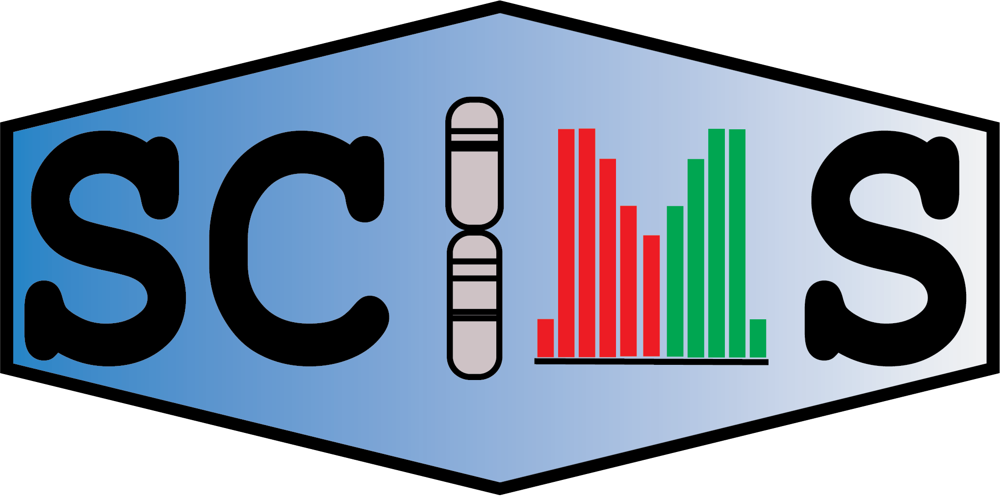

# Sex Calling in Metagenomic Sequences

<p align="center"></p>


A tool for inferring the chromosomal sex of a host organism from the alignment statistics of metagenomic sequencing data.   

[Report Bug](https://github.com/hanhntran/SCiMS-v1.1/issues/new?labels=bug&template=bug-report---.md) · [Request Feature](https://github.com/hanhntran/SCiMS-v1.1/issues/new?labels=enhancement&template=feature-request---.md)

## About The Project

Metagenomic sequencing data typically contains a mix of host and non-host (microbial) sequences. SCiMS uses the read-mapping statistics of the fraction of reads that align to the host genome to infer the chromosomal sex of the host. By restricting classification to the sex chromosomes and modeling the observed read counts directly, SCiMS provides host sex information that can be used in downstream analyses.

## Requirements

- Python 3.14+
- numpy, pandas, scipy, setuptools
- samtools for generating `.idxstats` files

## Installation instructions

The simpliest installation works through the [conda](https://docs.conda.io/en/latest/miniconda.html) installer that can maintain different versions of Python on the same machine. 

```
# Create a new conda environment with Python 3.14
conda create -n scims python=3.14

# Activate the environment
conda activate scims

# Install SCiMS
pip install scims
```

To confirm that the instillation was successful, run:

```
scims call -h
```

## Important Limitations and Usage Considerations

Before using SCiMS, please be aware of the following limitations and considerations:

### Intended Use

- **SCiMS should be run on raw sequencing data prior to host read removal.** Host-filtering procedures can distort chromosome representation and may bias sex inference. SCiMS is not intended for use on host-filtered datasets, including many publicly available human metagenomic datasets.
- **SCiMS infers chromosomal sex, not gender identity.** SCiMS is designed to infer the chromosomal sex (e.g., XX/XY or ZW/ZZ) of organisms with heterogametic sex chromosome systems. Gender identity cannot be inferred from genomic data and is not a feature of this tool.
- **SCiMS is currently designed for XY and ZW sex determination systems.** Performance has not been validated for organisms with other sex determination mechanisms, including environmental, polygenic, or other non-chromosomal systems.
- **SCiMS may be unreliable for individuals with atypical sex chromosome complements.** This includes individuals with sex chromosome aneuploidies (e.g., XXY, XYY, or X) or other sex-related biological characteristics that do not align with binary sex chromosome models.
- **Very low host DNA content may result in inconclusive calls.** While SCiMS performs well at low host read depths, reliable inference still requires sufficient reads mapping to host sex chromosomes.
- **Performance may be reduced in highly microbe-rich samples.** In samples with extremely low host DNA content (e.g., some stool metagenomes), a confident call may still be unreliable if too few reads map to the sex chromosomes.

### Ethical Considerations

- **Sex is often considered sensitive personal information.** Researchers should ensure that use of SCiMS is consistent with applicable ethical approvals, informed consent, and institutional policies.
- **Host-derived reads may contain additional sensitive genetic information beyond chromosomal sex.** Such information may include ancestry-related or clinically relevant genetic variation.
- **When working with human-derived data, users should carefully consider privacy implications** and follow best practices for data management, sharing, and deposition.

## Usage

Classification is run through the `scims call` subcommand. It accepts BAM files directly (requires samtools) or pre-computed `.idxstats` files, and works on alignment data from any sequencing platform, aligner, or genome assembly.

```
scims call \
    --idxstats_file <sample.idxstats> \
    --scaffolds <scaffolds.txt> \
    --homogametic_id <chrom_id> \
    --heterogametic_id <chrom_id> \
    --output_dir <output_directory>
```

The XY system is assumed by default. Pass `--ZW` for ZW organisms.

### Input (provide exactly one)


| Option              | Description                                        |
| ------------------- | -------------------------------------------------- |
| `--bam`             | Path to a single BAM file                          |
| `--bam_folder`      | Path to a folder of BAM files (batch mode)         |
| `--idxstats_file`   | Path to a single `.idxstats` file                  |
| `--idxstats_folder` | Path to a folder of `.idxstats` files (batch mode) |


### Required options


| Option               | Description                                                    |
| -------------------- | -------------------------------------------------------------- |
| `--scaffolds`        | Path to the `scaffolds.txt` file listing scaffolds of interest |
| `--homogametic_id`   | Scaffold ID for the homogametic sex chromosome (X or Z)        |
| `--heterogametic_id` | Scaffold ID for the heterogametic sex chromosome (Y or W)      |
| `--output_dir`       | Output directory                                               |


### Optional options


| Option              | Description                                                                          |
| ------------------- | ------------------------------------------------------------------------------------ |
| `-h, --help`        | Show the help message and exit                                                       |
| `--ZW`              | Use the ZW sex determination system (default: XY)                                    |
| `--threshold`       | Posterior probability threshold for a confident call (default: `0.95`)               |
| `--mismapping_rate` | Expected mismapping rate for reads on zero-ploidy chromosomes (default: `1e-4`)      |
| `--metadata`        | Path to a metadata file to annotate with the predicted sex                           |
| `--id_column`       | Sample ID column name in the metadata file (required when `--metadata` is specified) |
| `--log`             | Write a log file to the output directory                                             |


## Required input files

### `scaffolds.txt`

Since most assemblies include scaffolds representing other DNA than simply genomic (ex. mitochondrial), it is necessary to define what scaffolds we are interested in using for our analysis. This can be specified with a `scaffolds.txt` file. This is a single-column text file where each row is a scaffold ID. Here is an example, 

```
NC_000001.11
NC_000002.12
NC_000003.12
NC_000004.12
NC_000005.10
NC_000006.12
NC_000007.14
NC_000008.11
...
```

### `.idxstats files`

A .idxstats file can easily be created with samtools. If you have a .bam file of interest, fun the following commands to generate the .idxstats file:

```shell
samtools index <bam_file>
```

```shell
samtools idxstats <bam_file> > <prefix>.idxstats
```

### `metadata_file.txt`

A metadata file is required to run SCiMS. This file should contain at least one columns, `sample-id`. The `sample-id` column should contain the sample IDs that are present in the .idxstats file. 

Example:

```
sample-id	feature
sample1		A
sample2		B
sample3		C
sample4		D

```

## Example run

Example files can be found in the `test_data` folder.

### Single sample (from `.idxstats`)

Change path to the `test_data` folder and run the following command:

```
scims call \
    --idxstats_file ./idxstats_files/S79F300.idxstats \
    --scaffolds GRCh38_scaffolds.txt \
    --homogametic_id NC_000023.11 \
    --heterogametic_id NC_000024.10 \
    --output_dir out
```

### Single sample (directly from BAM)

```
scims call \
    --bam ./example.bam \
    --scaffolds GRCh38_scaffolds.txt \
    --homogametic_id NC_000023.11 \
    --heterogametic_id NC_000024.10 \
    --output_dir out
```

### Multiple samples (batch mode)

```
scims call \
    --idxstats_folder idxstats_files/ \
    --scaffolds GRCh38_scaffolds.txt \
    --homogametic_id NC_000023.11 \
    --heterogametic_id NC_000024.10 \
    --output_dir out \
    --metadata metadata_file.txt \
    --id_column sample-id \
    --log
```

For a species with a ZW system (e.g. birds), add `--ZW` and supply the Z and W scaffold IDs:

```
scims call \
    --BAM sample.bam \
    --scaffolds scaffolds.txt \
    --homogametic_id <Z_chrom_id> \
    --heterogametic_id <W_chrom_id> \
    --ZW \
    --output_dir out
```

## Output

SCiMS writes a results file per sample containing the inferred sex and the associated statistics from the likelihood ratio test (e.g. the posterior probability and likelihood ratio supporting the call). When a metadata file is supplied, an annotated copy is written with the predicted sex added as a column.

# Example pipeline: from raw reads to SCiMS

This example demonstrates a complete workflow for inferring host chromosomal sex from raw metagenomic sequencing reads, starting from paired-end FASTQ files and ending with a SCiMS classification. The example uses the human reference genome (GRCh38) with RefSeq scaffold identifiers; for other organisms, substitute the appropriate reference genome and sex-chromosome scaffold IDs.


## Software

The example uses the following tools (other equivalent tools may be substituted):

- [FastQC](https://www.bioinformatics.babraham.ac.uk/projects/fastqc/) — raw read quality assessment
- [fastp](https://github.com/OpenGene/fastp) — adapter and quality trimming
- [Bowtie 2](https://github.com/BenLangmead/bowtie2) — read alignment
- [SAMtools](https://www.htslib.org/) — alignment processing and `idxstats` generation
- [SCiMS](https://github.com/davenport-lab/SCiMS) — sex classification

## Input files

- `sample_R1.fastq.gz`, `sample_R2.fastq.gz` — raw paired-end metagenomic reads
- `GRCh38.fasta` — host reference genome (FASTA)
- `GRCh38_scaffolds.txt` — list of host scaffolds to use (see below)

## Step 1 — Quality control of raw reads

Assess the quality of the raw reads before processing:

```
fastqc sample_R1.fastq.gz sample_R2.fastq.gz -o fastqc_raw/
```

Inspect the reports to identify adapter contamination and any quality drop-off that should inform the trimming parameters.

## Step 2 — Adapter and quality trimming

Trim adapters and low-quality bases with fastp:

```
fastp \
    -i sample_R1.fastq.gz \
    -I sample_R2.fastq.gz \
    -o sample_R1.trimmed.fastq.gz \
    -O sample_R2.trimmed.fastq.gz \
    --detect_adapter_for_pe \
    --qualified_quality_phred 20 \
    --length_required 50 \
    --thread 8 \
    --json sample.fastp.json \
    --html sample.fastp.html
```

This removes adapters, discards reads with low quality scores, and drops reads shorter than 50 bp after trimming. Adjust thresholds to suit your data.

## Step 3 — Align metagenomic reads to the host reference

Build the Bowtie 2 index from the host reference genome once (this can be reused across all samples):

```
bowtie2-build --threads 8 GRCh38.fasta GRCh38_index
```

Align the trimmed reads to the host reference and convert directly to BAM:

```
bowtie2 -x GRCh38_index \
    -1 sample_R1.trimmed.fastq.gz \
    -2 sample_R2.trimmed.fastq.gz \
    -p 8 \
    | samtools view -bS - > sample.bam
```

## Step 4 — Sort and index the alignment

```
samtools sort -@ 8 -o sample.sorted.bam sample.bam
samtools index sample.sorted.bam
```

## Step 5 — Generate mapping statistics

`samtools idxstats` reports the number of mapped reads per scaffold, which is the input SCiMS uses:

```
samtools idxstats sample.sorted.bam > sample.idxstats
```

> SCiMS can also take a sorted, indexed BAM file directly with `--bam`, in which case it generates the `idxstats` internally and Step 5 can be skipped. The explicit `idxstats` step is shown here to make the pipeline transparent.

## Step 6 — Define the scaffolds of interest

SCiMS requires a `scaffolds.txt` file listing the host scaffolds to include (typically the nuclear autosomes plus the two sex chromosomes, excluding mitochondrial and unplaced contigs). For GRCh38 with RefSeq identifiers:

```
NC_000001.11
NC_000002.12
NC_000003.12
...
NC_000022.11
NC_000023.11   # X chromosome (homogametic)
NC_000024.10   # Y chromosome (heterogametic)
```

The scaffold IDs in this file, in the `.idxstats` file, and in the `--homogametic_id` / `--heterogametic_id` arguments must all match the names used in the reference genome.

## Step 7 — Run SCiMS

Classify the sample from the `.idxstats` file:

```
scims call \
    --idxstats_file sample.idxstats \
    --scaffolds GRCh38_scaffolds.txt \
    --homogametic_id NC_000023.11 \
    --heterogametic_id NC_000024.10 \
    --output_dir scims_out
```

Equivalently, starting directly from the sorted, indexed BAM file (skipping Step 5):

```
scims call \
    --bam sample.sorted.bam \
    --scaffolds GRCh38_scaffolds.txt \
    --homogametic_id NC_000023.11 \
    --heterogametic_id NC_000024.10 \
    --output_dir scims_out
```

The XY system is assumed by default; for a ZW organism, add `--ZW` and provide the Z and W scaffold IDs as the homogametic and heterogametic IDs, respectively.

## Processing many samples at once

For a study with many samples, generate one `.idxstats` file per sample (Steps 1–5), place them in a single directory, and run SCiMS in batch mode with a metadata file:

```
scims call \
    --idxstats_folder idxstats_files/ \
    --scaffolds GRCh38_scaffolds.txt \
    --homogametic_id NC_000023.11 \
    --heterogametic_id NC_000024.10 \
    --output_dir scims_out \
    --metadata metadata_file.txt \
    --id_column sample-id \
    --log
```

